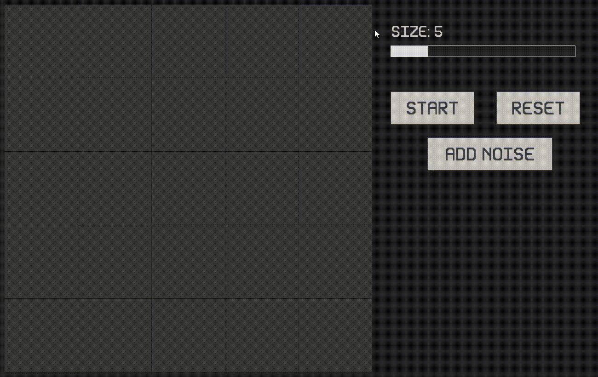

# Game of Life

Conway's Game of Life is a cellular automaton devised by mathematician John Conway. It's a zero-player game, meaning its evolution is determined by its initial state, requiring no further input from the user. The simulation evolves based on a set of simple rules applied to a grid of cells.

## Features

- **Interactive Grid Controls**:
Users can visually interact with the grid to toggle cell states, enabling intuitive initial state setup.

- **Adjustable Grid Size**:
Use the size slider to dynamically adjust the number of cells in the grid.

- **Simulation Controls**:
   - **Start/Pause**: Begin or pause the simulation with a single click.
   - **Reset**: Clear the grid and reset the simulation to its initial state.
   - **Noise Generator**: Add random noise to the grid.

## Rules of the Game

The game evolves based on the following rules applied to each cell in the grid:

1. **Underpopulation**:   A live cell with fewer than two live neighbors dies.

2. **Stasis** (State of Static Balance or Equilibrium): A live cell with two or three live neighbors lives on to the next generation.

3. **Overpopulation**: A live cell with more than three live neighbors dies.

4. **Reproduction**: A dead cell with exactly three live neighbors becomes a live cell.

These rules are applied simultaneously to every cell in the grid to determine the next generation.

## Demo
Here’s a quick preview of the game:


## Building the Project
**Note**: These instructions are specifically for Windows. For other platforms, adjust the paths and compilation steps accordingly.

### Requirements

- C++17 or higher
- SFML 2.6.1 or higher (prebuilt binaries)

### Setting up SFML
1. **Clone the project**:
   - Clone the repository from GitHub:
   ```bash
   git clone https://github.com/varun0138/Game-of-life.git
   cd Game-of-life
   ```

2. **Download SFML**: 
   - Download prebuilt binaries for SFML from the official [SFML website](https://www.sfml-dev.org/index.php).
   
3. **Configure your project**:
   - Extract the SFML binaries and place them in a folder (e.g., SFML-2.6.1).
   
4. **Add SFML to your environment**:
   - Update the `Makefile` included in the project with SFML libs and include paths.
   
   Example `Makefile`:
   ```makefile
   all: compile link run clean

   SFML_INCLUDE = C:/SFML-2.6.1/include
   SFML_LIB = C:/SFML-2.6.1/lib

   compile:
      g++ -c *.cpp Gui/*.cpp -std=c++17 -g -Wall -m64 -I $(SFML_INCLUDE) -DSFML_STATIC 

   link:
      g++ *.o -o main -L $(SFML_LIB) -lsfml-graphics-s -lsfml-window-s -lsfml-system-s -lopengl32 -lfreetype -lwinmm -lgdi32 

   clean:
      del *.o *.exe
      
   run:
      ./main
    ```
5. **Compile the project**:
    ```bash
    make
    ```